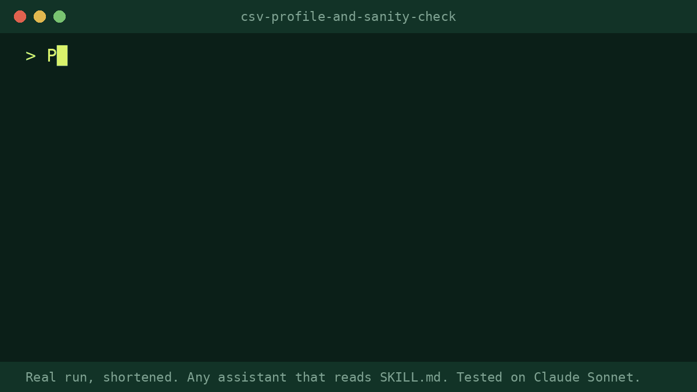

# CSV Profile and Sanity Check

Give it a CSV. It runs a small read-only script (Python 3 standard library) and reports rows, columns, each column's type, blanks, distinct values, ranges, duplicates, mixed formats, stray spaces, case variants and outliers, then lists questions to ask the data's owner. Without code execution it profiles a pasted sample and says so.

## Install
Any assistant that reads the open SKILL.md format works.
1. Copy the `csv-profile-and-sanity-check` folder into `.agents/skills/` in your project (or `~/.agents/skills/` for everywhere). Or run `npx skills add proskillpacks/skills`. Or use your tool's own skills folder.
2. Ask in plain words, for example: "Profile this CSV before I use it: [file]. It should contain ..."

**No install:** open `prompt.md`, copy it into ChatGPT or any chatbot and paste your material where marked.

## Works with
Any assistant that reads SKILL.md (Claude, Codex, Gemini CLI, Cursor, GitHub Copilot and others) and any chatbot via `prompt.md`. Tested on Claude Sonnet.

## Before / after
> **Before:** Opening a 891-row export and scrolling for a few minutes to see if it looks fine.
>
> **After (skill output, from a real test run):** Test run on a public 891-row passenger CSV. It reported 19% blank in Age (177 rows) and 77% blank in Cabin, 15 zero fares, 53 high fare outliers, a Ticket column that should be read as text, trailing spaces in names and 2 blank Embarked values, named the two rows, and asked the owner eight questions, such as whether Fare is per person or per ticket. It changed nothing in the file.

## Limits
- It reads only. It never edits, sorts or cleans the file.
- A profile cannot tell you whether values are true or whether rows are missing.
- Without code execution it works from the sample you paste and says so. Counts cover only that sample.
- It does not guess what unclear columns mean. It asks.
- It does not guarantee results. You review the output before you use it.

## Tested
1 run on a real public CSV (Claude Sonnet) with the script. The script output was used as the facts.

---

Made by Pro Skill Packs. MIT licensed: use it, change it, share it.

More skills: https://proskillpacks.github.io/ . Pairs with the paid Messy CSV Cleaner, Spreadsheet Formula and Cleanup and Survey Results Summariser.
