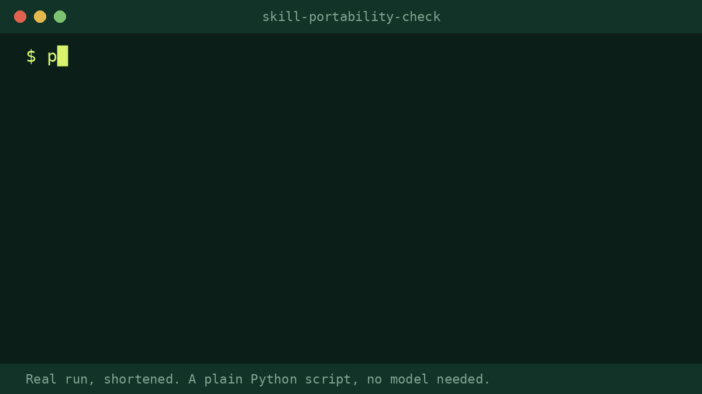

# Skill Portability Check



A free checker for Agent Skills. Point it at a skill folder or a whole repository of skills and it reports, per SKILL.md, the things that make a skill fail to load or stop it working outside one assistant: frontmatter that strict YAML parsers reject, keys other than name and description, vendor tool names and paths, missing fallbacks, long bodies and broken links. One Python file, standard library only, with a non-zero exit code for CI.

## What it does
- Parses the frontmatter the way a strict YAML parser does. The classic trap is an unquoted colon in the description, which makes tools such as `npx skills` skip the skill without a clear message.
- Checks name format and length (and that it matches the folder), description length, and whether the description says when to use the skill.
- Flags vendor tool names (WebFetch, Skill tool, Bash(...), mcp__), vendor paths, tool-specific keys, and text some tools substitute (`$ARGUMENTS`, `$0`).
- Warns when the text relies on the web, a shell or a script but never says what to do when it is missing, and finds broken relative links and mentioned files that are not there.
- Prints a table, or `--json`. Exit code 1 on errors only; `--strict` makes warnings fail too.

## Install
Any assistant that reads the open SKILL.md format works.
1. Copy the `skill-portability-check` folder into `.agents/skills/` in your project (or `~/.agents/skills/` for everywhere). Create the folder if it is not there. Or use your tool's own skills folder (for example `.claude/skills/` for Claude Code).
2. Ask in plain words, for example: "Check my skills repo for portability problems."

**No skills support?** Run the script yourself: `python3 scripts/skill_check.py <path>`. Or paste your SKILL.md into the prompt in `prompt.md`.

Every finding starts with a rule ID such as `[SC008]`. Silence a rule with `--ignore SC008,SC013`. The same checker is also packaged as a GitHub Action and pre-commit hook: https://github.com/proskillpacks/skill-check

Needs: Python 3 (standard library only) to run the script. Without a shell, the skill checks a pasted SKILL.md by reading.

## Works with
Works with any AI assistant that reads SKILL.md (Claude, OpenAI Codex, Gemini CLI, Cursor, GitHub Copilot and others). We run our release tests on Claude Sonnet and Opus.

## Before / after (real public data, anonymised)
Our own public skills repository on 2026-10-04: it had grown to 15 skills, and a new one was skipped by `npx skills add proskillpacks/skills --list` with a YAML error. The same rule, run over our whole tree of 57 skills, found 7 descriptions with an unquoted colon (now fixed), and the checker's other warnings led us to add fallback sentences and remove a vendor tool name.

> **After (skill output, excerpt):**
> $ python3 scripts/skill_check.py proskillpacks-skills/skills --quiet
> skill                           errors  warnings  lines  scripts
> accessibility-quick-audit            0         0     39  -
> changelog-from-commits               0         0     39  -
> readme-first-run-check               0         0     39  -
> agent-ready-quick-check              0         0     64  Python
> late-payment-chaser-uk               0         0    109  Python
> ...
> 15 skill(s): 0 error(s), 0 warning(s)
>
> $ python3 scripts/skill_check.py examples/bad-yaml-colon/SKILL.md
>   ERROR  frontmatter: line 3: description: unquoted ': ' inside the value (strict YAML reads it as a nested mapping). Quote the value or reword

## Use it in CI
Copy `examples/skill-check.yml` to `.github/workflows/skill-check.yml` in your repository. It downloads `skill_check.py`, checks every `SKILL.md` and fails the build on errors:

```yaml
name: skill-check
on: [push, pull_request]
jobs:
  skill-check:
    runs-on: ubuntu-latest
    steps:
      - uses: actions/checkout@v4
      - run: curl -fsSL https://raw.githubusercontent.com/proskillpacks/skills/main/skills/developers/skill-portability-check/scripts/skill_check.py -o skill_check.py
      - run: python3 skill_check.py . --quiet
```
Add `--strict` to fail on warnings too. Put a file named `.skill-check-ignore` in a folder of test fixtures to skip it.

## Honest limits
- It reads files. It does not run your skill, so it cannot tell whether the instructions work or whether the skill triggers.
- The rules follow the public Agent Skills spec and our own study of 69 popular skills. Tools differ: a warning is a portability risk, not a guarantee of breakage.
- Pattern lists (vendor tool names, products, paths) are not exhaustive.
- It never says a skill is valid or portable. It says what it found and what it did not check.
- It does not guarantee results. You review the output before using it.

## Tested
Run on our whole tree of 57 skills and on its own fixtures (`python3 scripts/test_skill_check.py`: four fixtures, good and bad, plus the `--strict` exit code). Every error and the reasonable warnings it found in our own skills were fixed. Python 3 only; no other dependencies.

---

Made by Pro Skill Packs. Free under the MIT licence.
