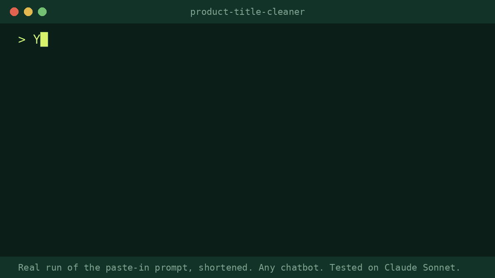

# product-title-cleaner

A free Agent Skill that gives your whole Shopify catalogue one consistent title pattern and hands you a CSV you can import as is.

It works out the pattern most of your titles already follow. Then it fixes only the titles that break it:
- promo words in titles (`NEW`, `SALE`, `Last Call`, `🔥`)
- ALL CAPS
- mixed separators (`|`, `,`, `–`)
- sizes that should be variants
- inconsistent units (`12oz` and `12 oz`)
- a missing product type

It leaves your product names, brand styling, trademarks and model numbers alone. It also leaves alone titles that are already fine.

Give it a store URL, a collection URL, or a product export CSV.

## What you get

- `<store>-titles-shopify-import.csv`: `URL handle,Title`, **changed rows only**. Import it with "Overwrite products with matching handles". Columns not in the file keep their values, and URLs don't change.
- `<store>-titles-review.csv`: every product, old vs new, with the reason for each change.
- A short report covering the pattern it chose and why, a before/after table, and the things only you can decide (collab styling, possible typos, abbreviations).
- Built-in safety:
  - Skips gift cards, placeholder or "Content" products, and add-ons.
  - Never creates a duplicate title, even when you clean only one collection. It checks against the rest of the store.

## Before / after (patterns from real tests, 2026-10-03; product names changed so stores can't be identified)

| Before | After | Why |
|---|---|---|
| `Dark Roast, Cold Brew Coffee, Oat Milk` | `Dark Roast Cold Brew Coffee - Oat Milk` | one separator |
| `House Blend Coffee (12oz Ground)` | `House Blend Ground Coffee (12 oz)` | type before size, unit format |
| `Born To Roam Tee` | `Born to Roam Tee` | title case |
| `Ranger Shearling - Brown` | `Ranger Shearling Boot - Brown` | product type added (taken from the store's own product type, "Boots") |
| `Studio  x Partner Court Sneaker - Bone` | `Studio x Partner Court Sneaker - Bone` | double space |

On one 147-product coffee and merch catalogue it changed 13 titles and left 134 alone.

## Install
<!-- install:begin SKILL {"FOLDER": "product-title-cleaner"} -->
Any assistant that reads the open SKILL.md format works. Copy the `product-title-cleaner/` folder into `.agents/skills/` (one project) or `~/.agents/skills/` (all projects).

| Tool | Skills folder |
|---|---|
| Claude Code | `~/.claude/skills/` (project: `.claude/skills/`) |
| Codex | `~/.agents/skills/` (project: `.agents/skills/`) |
| Gemini CLI | `~/.gemini/skills/` or `~/.agents/skills/` |
| claude.ai (web and desktop apps) | zip the folder, then Settings > Capabilities > Skills > Upload skill |
| Cursor, Copilot, others | see your tool's docs: https://agentskills.io/clients |

**No skills support?** Paste `prompts/product-title-cleaner.md` from the repo into ChatGPT or any chatbot.
<!-- install:end -->

Then ask: *"Clean up the product titles on mystore.com and give me an import CSV"*

- In claude.ai: Upload your product export CSV with the request.
- The helper script is Python 3, standard library only.

## Scope

It changes only the product **title**. It doesn't write SEO titles, meta descriptions or product descriptions. The paid pack's SEO fixer and description rewriter do those.

---

Made by Pro Skill Packs. We tested this skill on real public Shopify stores before release.

The paid **Store Ops Pack** for Shopify store owners (AI-agent readiness audit for your store, product description rewriter, SEO fixer with collection pages, support macros, chargeback responses, BFCM campaign kit) is here: https://proskillpacks.gumroad.com/l/store-ops-pack

Not affiliated with or endorsed by Shopify Inc.

More skills: https://proskillpacks.github.io/
