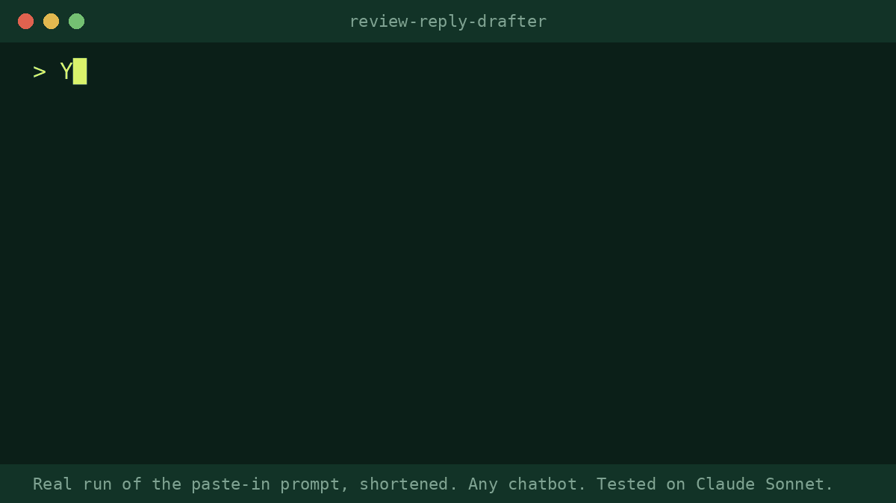

# review-reply-drafter

A free Agent Skill that drafts replies to your store's reviews. Paste in reviews from Judge.me, Shopify Product Reviews, Yotpo, Okendo, Google or Trustpilot, and you get back a reply for each one, ready to paste.

- **Happy customers** get thanked for the specific thing they said, not "Thanks for your review!"
- **Unhappy customers** get an acknowledgement in their own words, one concrete next step, and an invitation to a private channel.
- **It never commits you to anything.** It doesn't admit fault or offer refunds, credits or discounts you didn't approve. Those go in a `[REMEDY …]` placeholder for you to decide.
- **It flags reviews that need a human**: allergic reaction or injury, contamination, legal threats, chargebacks ("went to my bank"), accusations. Each gets a safe holding reply.
- **4 or more reviews** come back as one table, followed by a "Needs a human" list and every placeholder you need to fill in.

## Install
<!-- install:begin SKILL {"FOLDER": "review-reply-drafter"} -->
Any assistant that reads the open SKILL.md format works. Copy the `review-reply-drafter/` folder into `.agents/skills/` (one project) or `~/.agents/skills/` (all projects).

| Tool | Skills folder |
|---|---|
| Claude Code | `~/.claude/skills/` (project: `.claude/skills/`) |
| Codex | `~/.agents/skills/` (project: `.agents/skills/`) |
| Gemini CLI | `~/.gemini/skills/` or `~/.agents/skills/` |
| claude.ai (web and desktop apps) | zip the folder, then Settings > Capabilities > Skills > Upload skill |
| Cursor, Copilot, others | see your tool's docs: https://agentskills.io/clients |

**No skills support?** Paste `prompts/review-reply-drafter.md` from the repo into ChatGPT or any chatbot.
<!-- install:end -->

Then ask: *"Draft replies to these Judge.me reviews"* and paste them. To let it offer a remedy, say so: *"we offer a free replacement for anything that broke within 30 days, support email is help@yourstore.com"*. It uses the remedy only where it applies.

## Before / after (real public review, quoted in part)

A 2★ Judge.me review of a men's cologne from a grooming brand:

> **Before:** "…1/3 of the product had leaked into the packaging during shipping. Good product. Poor packaging." *(no store reply)*

> **After (skill output, product name replaced with [Product]):** "A third of the cologne ending up in the packaging is a rough way to meet [Product], and we're sorry the shipping overshadowed a scent you liked. Contact us at [support email] and we'll [REMEDY: replacement / refund / store credit; owner to choose]."

In the same 14-review batch, the skill also:
- caught a 1★ review with glowing text as a probable mis-tap, without asking publicly for a rating change;
- flagged an "opened, unhygienic products" plus "intentional damage" review for the owner instead of arguing in public;
- replied once to a review that had been posted on two products.

## What it won't do
- Post anything. You paste the replies yourself.
- Invent policies, restock dates or causes.
- Ask a Trustpilot reviewer to change their rating.

## Tested
We tested it on 3 real review sets: public Judge.me reviews from a grooming brand and a jewellery brand, and the Trustpilot page of a coffee brand. Every run was scored against a written rubric, and the final runs scored 9, 9.5 and 9 out of 10. The test logs are kept internally.

---

Made by Pro Skill Packs. We tested this skill on real public reviews before release.

The paid **Store Ops Pack** for Shopify store owners (AI-agent readiness audit for your store, product description rewriter, SEO fixer with collection pages, support macros, chargeback responses, BFCM campaign kit) is here: https://proskillpacks.gumroad.com/l/store-ops-pack

Not affiliated with or endorsed by Shopify Inc.

More skills: https://proskillpacks.github.io/

Wording you can copy without the skill: [review replies](https://proskillpacks.github.io/stores/how-to-respond-to-a-negative-review/)
