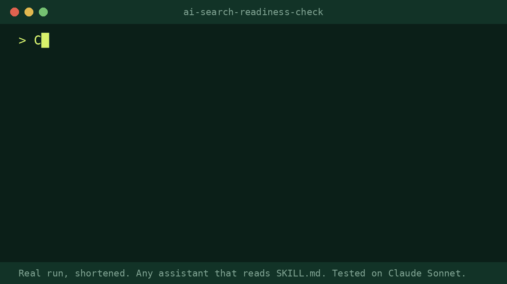

# ai-search-readiness-check

*Free from Pro Skill Packs, for marketers and small agencies who fix client websites.* The Page Fix Sheet (9 USD) checks one page's title, description, headings, canonical and structured data, and writes replacements from the page's own facts: https://proskillpacks.github.io/

Give it a website address. It checks whether AI search tools such as ChatGPT search, Perplexity, Claude and Google can read the home page, and gives a score out of 100 from 8 checks, the evidence for each, and the fixes in order. A script does the fetching and scoring, so the same site gets the same score.

## What it does
- Reads robots.txt for 8 AI search and user agents, and lists 6 training crawlers separately (not scored: blocking them is a business choice).
- Checks noindex, the text in the server-rendered page, title and description, Organization or LocalBusiness structured data, question-style content, the sitemap and llms.txt.
- Lists every fix with the evidence quoted, biggest loss first, and ends with three sentences you can send to the client.

## Install
<!-- install:begin SKILL {"FOLDER": "ai-search-readiness-check"} -->
Any assistant that reads the open SKILL.md format works. Copy the `ai-search-readiness-check/` folder into `.agents/skills/` (one project) or `~/.agents/skills/` (all projects).

| Tool | Skills folder |
|---|---|
| Claude Code | `~/.claude/skills/` (project: `.claude/skills/`) |
| Codex | `~/.agents/skills/` (project: `.agents/skills/`) |
| Gemini CLI | `~/.gemini/skills/` or `~/.agents/skills/` |
| claude.ai (web and desktop apps) | zip the folder, then Settings > Capabilities > Skills > Upload skill |
| Cursor, Copilot, others | see your tool's docs: https://agentskills.io/clients |

**No skills support?** Paste the prompt version (`prompts/ai-search-readiness-check.md` in the download) into ChatGPT or any chatbot.
<!-- install:end -->

- The helper script needs `python3`, with no extra packages.
- In claude.ai: Code execution must be on, and its network access must allow all domains (Settings > Capabilities), because the helper reads the site. Not yet tested in claude.ai; if it can't fetch, use the prompt version.

It reads the home page and robots.txt politely, as itself, and obeys robots.txt (if robots.txt won't load because of a server error, it reads nothing, as the robots.txt standard says).

Then ask: *"Can ChatGPT and other AI search tools read https://example.com?"*

## Works with
Works with any AI assistant that reads SKILL.md (Claude, OpenAI Codex, Gemini CLI, Cursor, GitHub Copilot and others). We run our release tests on Claude Sonnet and Opus. Use the strongest model your assistant offers.

## Before / after (real public data, anonymised)
Source: a small local plumbing business site.

> **Before:** "Can ChatGPT and other AI search tools actually read my client's site?"
>
> **After (skill output, unedited, excerpt):** "## AI search readiness: 85/100 [...] 1. **Add Organization or LocalBusiness structured data (15 points lost).** The home page's JSON-LD only declares `WebSite`. LocalBusiness (or the more specific `Plumber` type) states who the business is in a form machines can read. It must use [the business's] real name, address and phone number." 

## Honest limits
- It checks the home page only, and what the server sends before any JavaScript runs.
- Firewalls and bot protection can block AI agents even when robots.txt allows them; it can't test that from outside.
- It can't tell you whether any AI tool actually cites the site, and it promises no visibility, ranking or traffic.
- llms.txt is scored low on purpose: it is a proposal, and no AI search engine has confirmed it uses it.
- The score is our checklist with our own weights, not a score from any AI company.
- It doesn't guarantee results. You review the output before using it.

## Tested
8 real tests on public websites: a small trade site, a dental practice, two small software companies, a bakery, a US vet hospital, a US dentist, and a US dental practice whose robots.txt keeps automated readers out. Each was run as a skill, four also as the pasted prompt version and two on a second model. The score and every point matched the script in every run. Final scores 8.5, 8.5, 8.5, 8.5, 9, 9, 9 and 9 out of 10 (prompt version: 9, 8.5, 9 and 8.5), under a strict rubric where one wrong fact caps a test at 6. An independent review found the prompt version stated a question count it had guessed; counts made by reading are now marked as estimates and kept out of the client summary. A second review found the script missed structured data typed as a specific business (a vet, a dentist); it now uses schema.org's full list of business types.
