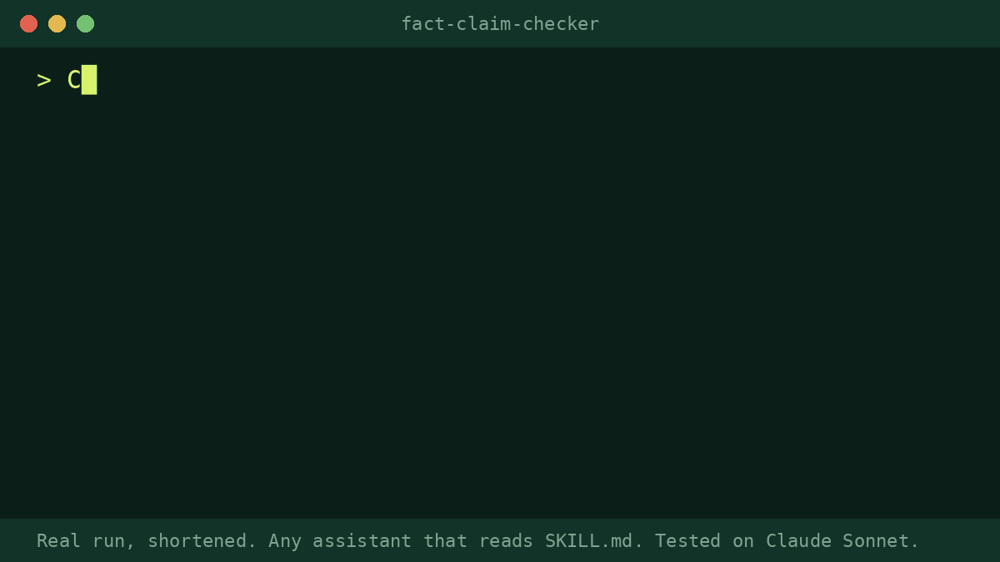

# Fact-Claim Checker

Paste a draft before you publish it. You get a list of the claims that need a source, ranked by risk, with the kind of source that would settle each one, and safer wording for the high-risk ones you cannot back up. It does not tell you what is true. It tells you what to check.

## What it does
- Finds numbers, studies, quotes, superlatives, cause and effect, and claims about named people or companies.
- Ranks each claim high, medium or low and says what would settle it.
- Catches things that conflict inside the draft: dates that do not add up, a quote that changes, "under 10k" next to "up to 10k".
- Offers safer wording with [SOURCE: ...] blanks, and a list of sources to collect, in order of risk.

## Install
Any assistant that reads the open SKILL.md format works.
1. Copy the `fact-claim-checker` folder into `.agents/skills/` in your project (or `~/.agents/skills/` for everywhere). Create the folder if it is not there. Or use your tool's own skills folder (for example `.claude/skills/` for Claude Code).
2. Ask in plain words, for example: "Fact-check my draft before I publish it."

**No install:** open `prompt.md`, copy it, paste it into ChatGPT or any chatbot, and add your draft where marked.

Needs: nothing. It works from the text you paste.

## Works with
Works with any AI assistant that reads SKILL.md (Claude, OpenAI Codex, Gemini CLI, Cursor, GitHub Copilot and others). We run our release tests on Claude Sonnet and Opus. Use your assistant's strongest model: in our tests, a small, fast model added facts that were not in the source data.

## Before / after (real public data, anonymised)
A public launch post from a small software company, with prices, dates, a user count and a discount, mixed with opinion.

> **After (skill output, excerpt):**
> Claims found: 17. High risk: 6. Medium: 7. Low: 4.
> "more than 60 people have signed up used Plausible successfully": a number, and "successfully" is undefined. A typo changes the meaning ("signed up used").
> "up to 10k pageviews - $6 / mo" versus later "a small (<10k) tier": pick one.
> Safer wording: "More than 60 people have signed up for the beta, and [N] of them have [SOURCE: your definition of 'successfully']."
>

## Honest limits
- It does not look anything up and it does not rule claims true or false. A claim can look fine and be wrong.
- It can over-flag. Dates and stated intentions get listed as low risk. You decide what matters.
- It is an editing pass, not a legal, medical or financial review. For those topics, check with a qualified professional.
- It works from your text only unless you give it sources.
- It does not guarantee results. You review the output before using it.

## Tested
1 real-data run on a public launch post (Claude Sonnet). We read every flagged claim against the source text: all 17 were real claims, and the two conflicts it raised were real. Not yet run on other models.

---

Made by Pro Skill Packs. Free under the MIT licence.

More skills: https://proskillpacks.github.io/
